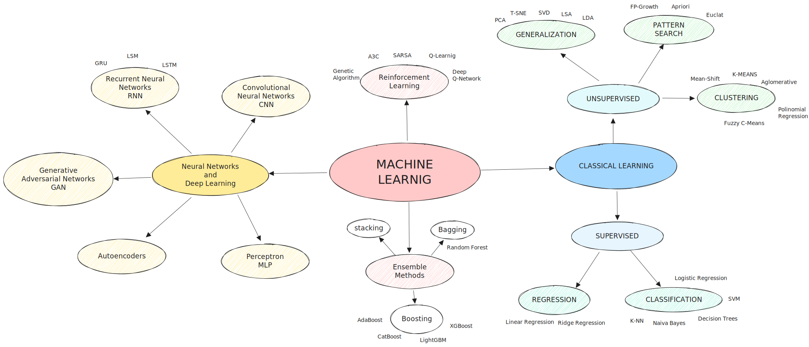

## MLOPS-Playground

  

Este repositório é um ambiente dedicado para estudos e experimentos relacionados a Machine Learning Operations (MLOps). 
Aqui, você encontrará uma coleção de notebooks, códigos de exemplo, tutoriais e recursos relacionados a uma variedade de algoritmos, 
bibliotecas e ferramentas no campo de Machine Learning e MLOps.

### Objetivo

- Explorar e aprender sobre diferentes algoritmos de Machine Learning, incluindo XGBoost e LightGBM.
- Experimentar com bibliotecas populares, como scikit-learn, TensorFlow, PyTorch e muito mais.
- Realizar estudos aprofundados sobre séries temporais, incluindo conceitos básicos, métodos de previsão e modelagem estatística.
- Desenvolver habilidades em práticas de MLOps, incluindo a construção de pipelines de treinamento e implantação de modelos.
- Entender como implantar modelos em produção de forma segura, confiável e eficiente.

### Estrutura do Repositório
